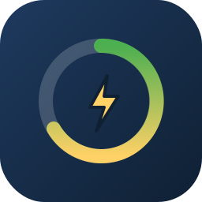

<p align="center"></p>

# KI Klima Strøm-kort

Lovelace-kortet til [KI Energi](https://github.com/SebastianKristo/ki-strom) — hele klima- og
energisystemet i ett kort: status med motorens resonnement, soner med grafer, timebudsjett,
nettleie etter døgnmaks (topp tre per dato), varmtvann, håndklevarmer, gardiner, moduser og
beslutningslogg. Norsk. Ingen konfigurasjon utover å legge det til.

Krever integrasjonen **KI Energi** (`ki_energi`) installert og satt opp.

## Installasjon (HACS)

1. HACS → Frontend → ⋮ → *Custom repositories* → `https://github.com/SebastianKristo/ki-klima-strom-kort`,
   kategori **Dashboard**.
2. Last ned. HACS legger til ressursen `/hacsfiles/ki-klima-strom-kort/ki-klima-strom-kort.js` selv.
3. Hard-refresh nettleseren (Ctrl/Cmd + Shift + R).

Manuelt: kopier `ki-klima-strom-kort.js` til `/config/www/` og legg til
`/local/ki-klima-strom-kort.js` som JavaScript-modul under Innstillinger → Dashbord → Ressurser.

## Bruk

```yaml
type: custom:ki-klima-strom-kort
```

Det gamle navnet `custom:ki-klima-pro-card` fungerer fortsatt.

### Som popup (Bubble Card)

```yaml
type: custom:bubble-card
card_type: pop-up
hash: "#klima"
name: Klima og strøm
icon: mdi:home-thermometer
show_header: true
card_layout: large
# innhold:
cards:
  - type: custom:ki-klima-strom-kort
```

Og en knapp som åpner den:

```yaml
type: custom:bubble-card
card_type: button
button_type: name
name: Klima og strøm
icon: mdi:home-lightning-bolt
tap_action:
  action: navigate
  navigation_path: "#klima"
```

### Faner

| Fane | Innhold |
|---|---|
| Oversikt | Status med ring (forventet/tillatt effekt), «Slik tenker motoren nå», leggetid, timebudsjett, siste 12 timer |
| Soner | Hver sone med mål, effekt, temperatur og graf (temperatur/effekt), overstyring |
| Energi | Dynamisk grense: døgnmaks i dag, topp tre med datoer, trinn, prognose, døgngraf, effekt siste 6 timer, besparelse |
| Vann og bad | Bereder (legionella, prisstyring med døgnstripe) og håndklevarmer |
| Tanker | Vurdering per sone, prognose, diagnostikk, beslutningslogg |
| Oppsett | Brytere gruppert, varslinger, tider som døgnplan, elbil, gardiner |
| Avansert | Grenser, helgevarsler, tarifftabell, tidskonstanter, råtilstand |

Alle blokker kan legges sammen; kortet husker hva som er åpent. Alle tall- og klokkeslettfelt
er rullevelgere (hjul på mobil).

## Versjonering

Kortet versjoneres uavhengig av integrasjonen. Det leser bare sensorer og hjelpere fra
`ki_energi`, så et nyere kort virker med en eldre integrasjon (nye blokker viser bare «–»).
